<p align="center">
  
</p>

<h1 align="center">🎓 OPUS (SW프로젝트관리시스템)</h1>

<p align="center">
<strong>OPUS</strong>는 부산대학교 내 SW 프로젝트(캡스톤/해커톤/교과 등)의 성과를 <strong>등록, 관리, 공유</strong>하고,<br>
운영 측면에서는 <strong>대회/팀/결과물</strong>을 효율적으로 관리하는 시스템입니다.
</p>


<p align="center">
  <a href="https://opus.pusan.ac.kr/">🌐 운영 서비스 이동</a> | 
  <a href="https://github.com/PNUops/opus-backend">🧩 Production Repo 이동</a> | 
  <a href="https://opus.pnu.app/api/docs/">📄 Spring Rest Docs </a> | 
  <a href="https://opus.pnu.app">🔨 개발 서버 </a> | 
  <a href="https://github.com/PNUops/ops-mvp-back">📦 MVP Backend</a>
</p>
<br>

<h2 align="left">🛠 Tech Stack</h2>

<p align="center">
  <strong>Language & Core</strong><br>
<br>
  
  
  
  
</p>

<p align="center">
  <strong>Data & Media</strong><br>
<br>
  
  
  
  
</p>

<p align="center">
  <strong>Documentation & Test</strong><br>
<br>
  
  
  
  
</p>
<br>

## 🏗️ Structure
```
─ src
   ├─ main
   │  ├─ java
   │  │  └─ com
   │  │     └─ opus
   │  │        └─ opus
   │  │           ├─ OpusApplication.java
   │  │           ├─ docs
   │  │           │  └─ asciidoc
   │  │           ├─ global
   │  │           │  ├─ base
   │  │           │  ├─ config
   │  │           │  ├─ error
   │  │           │  └─ security
   │  │           └─ modules
   │  │              ├─ member                         
   │  │              │  ├─ api
   │  │              │  │  └─ Membercontroller.java
   │  │              │  ├─ application
   │  │              │  │  ├─ convenience
   │  │              │  │     └─ MemberConvenience.java
   │  │              │  │  └─ dto
   │  │              │  │     ├─ request
   │  │              │  │     └─ response
   │  │              │  │  ├─ MemberCommandService.java
   │  │              │  │  └─ MemberQueryService.java
   │  │              │  ├─ domain
   │  │              │  │  ├─ Member.java
   │  │              │  │  ├─ dao
   │  │              │  │     └─ MemberRepository.java
   │  │              │  └─ exception
   │  │              │     ├─ MemberException.java
   │  │              │     └─ MemberExceptionType.java
   │  │              ├─ contest
   │  │              ├─ file
   │  │              ├─ notice
   │  │              └─ team
   │  └─ resources
   │     ├─ application.yml
   │     ├─ application-secret.yml
   │     └─ schema.sql
   └─ test
      ├─ java
      │  └─ com
      │     └─ opus
      │        └─ opus
      │           ├─ helper
      │           │ ├─ ApiTestHelper.java
      │           │  └─ IntegrationTest.java
      │           ├─ restdocs
      │           │  ├─ docs
      │           │      ├─ MemberApiDocsTest.java
      │           │      └─ ...
      │           │  ├─ RestDocsConfig.java
      │           │  └─ RestDocsTest.java  
      │           ├─ member                         
      │           │  ├─ application
      │           │      ├─ MemberCommandServiceTestjava
      │           │      └─ MemberQueryServiceTest.java
      │           │  └─ MemberFixture
      │           ├─ ...     
      └─ resources
```
<br>

## ✨ Key Features & Engineering Points
(추가 예정)
<br>

## 🗂 Database ERD

전체 컬럼과 제약 조건은 [`src/main/resources/schema.sql`](src/main/resources/schema.sql)에서 확인할 수 있습니다.

> 모든 테이블은 `created_at`, `updated_at`을 공통으로 가지며, 대부분 `is_deleted` 기반 논리 삭제를 사용합니다.
> 모듈 간 참조는 JPA 연관관계 대신 ID만 저장하는 컨벤션을 따르므로, 아래 관계 중 실제 DB 외래키 제약이 걸린 것은 `file` 계열 3개뿐입니다.

```mermaid
erDiagram
    %% ── Contest 모듈 ──
    contest_category ||--o{ contest : "category_id"
    contest ||--o{ contest_award : "contest_id"
    contest ||--|| contest_template : "contest_id (UK)"
    contest ||--|| contest_sort : "contest_id (UK)"
    contest ||--o{ contest_track : "contest_id"
    contest ||--o{ contest_submission_item : "contest_id"
    contest ||--o{ contest_member : "contest_id"
    contest ||--o{ notice : "contest_id"
    contest_track ||--o{ contest_submission_item : "contest_track_id"
    contest_submission_item ||--o{ contest_submission_item_file_formats : "element collection"
    contest_submission_item ||--o{ contest_submission : "contest_submission_item_id"
    contest_submission ||--o| contest_submission_memo : "contest_submission_id (UK)"
    contest_submission ||--o{ contest_submission_feedback : "contest_submission_id"
    contest_member ||--o{ contest_member_team_ids : "element collection"

    %% ── Team 모듈 ──
    contest ||--o{ team : "contest_id"
    contest_track ||--o{ team : "track_id"
    team ||--o{ team_member : "team_id"
    team ||--o{ team_comment : "team_id"
    team ||--o{ team_like : "team_id"
    team ||--o{ team_vote : "team_id"
    team ||--o{ team_contest_award : "team_id"
    team ||--o{ contest_submission : "team_id"
    team ||--o{ contest_member_team_ids : "team_id"
    team_member ||--o{ team_member_roles : "element collection"
    contest_award ||--o{ team_contest_award : "contest_award_id"

    %% ── Member 모듈 ──
    member ||--o{ member_roles : "element collection"
    member ||--o{ contest_member : "member_id"
    member ||--o{ contest_submission_feedback : "member_id"
    member ||--o{ team_member : "member_id"
    member ||--o{ team_comment : "member_id"
    member ||--o{ team_like : "member_id"
    member ||--o{ team_vote : "member_id"
    member ||--o{ notification : "member_id"
    member ||--o{ member_withdrawal_history : "member_id"

    %% ── File 모듈 ──
    file ||--|| file_image : "file_id (UK)"
    file ||--|| file_feedback : "file_id (UK)"
    file ||--|| file_document : "file_id (UK)"
    contest_submission ||--o{ file_document : "submission_id"
    contest_submission_feedback ||--o{ file_feedback : "feedback_id"

    contest_category {
        bigint id PK
        varchar category_name
        bit is_deleted
    }
    contest {
        bigint id PK
        bigint category_id FK
        varchar contest_name
        bit is_current
        int max_votes_limit
        datetime vote_start_at
        datetime vote_end_at
    }
    contest_award {
        bigint id PK
        bigint contest_id FK
        varchar award_name
        varchar award_color
    }
    contest_template {
        bigint id PK
        bigint contest_id FK "UK"
        bit track_required
        bit team_name_required
        bit overview_required
    }
    contest_sort {
        bigint id PK
        bigint contest_id FK "UK"
        enum mode "ASC, CUSTOM, RANDOM"
    }
    contest_track {
        bigint id PK
        bigint contest_id FK
        varchar track_name
    }
    contest_submission_item {
        bigint id PK
        bigint contest_id FK
        bigint contest_track_id FK "nullable"
        varchar name
        datetime start_at
        datetime end_at
        bit allow_late_submission
        int max_file_count
        int max_file_size_mb
        enum visibility "TEAM, STAFF, MEMBER, PUBLIC"
    }
    contest_submission_item_file_formats {
        bigint contest_submission_item_id PK
        enum file_format PK
    }
    contest_submission {
        bigint id PK
        bigint contest_submission_item_id FK
        bigint team_id FK
        datetime first_submitted_at
    }
    contest_submission_memo {
        bigint id PK
        bigint contest_submission_id FK "UK (active)"
        varchar content
    }
    contest_submission_feedback {
        bigint id PK
        bigint contest_submission_id FK
        bigint member_id FK
        varchar description
        tinyint is_read
    }
    contest_member {
        bigint id PK
        bigint contest_id FK
        bigint member_id FK
    }
    contest_member_team_ids {
        bigint contest_member_id PK
        bigint team_id PK
    }
    notice {
        bigint id PK
        bigint contest_id FK "nullable"
        varchar title
        varchar description
    }

    team {
        bigint id PK
        bigint contest_id FK
        bigint track_id FK "nullable"
        varchar team_name
        varchar project_name
        varchar professor_name
        varchar overview
        bit is_submitted
        int item_order
    }
    team_member {
        bigint id PK
        bigint team_id FK
        bigint member_id FK
    }
    team_member_roles {
        bigint team_member_id PK
        enum role PK "ROLE_팀원, ROLE_팀장"
    }
    team_comment {
        bigint id PK
        bigint team_id FK
        bigint member_id FK
        varchar description
    }
    team_like {
        bigint id PK
        bigint team_id FK
        bigint member_id FK
    }
    team_vote {
        bigint id PK
        bigint team_id FK
        bigint member_id FK
    }
    team_contest_award {
        bigint id PK
        bigint team_id FK
        bigint contest_award_id FK
    }

    member {
        bigint id PK
        varchar email "UK"
        varchar student_id "UK, nullable"
        varchar name
        varchar password "nullable"
        varchar social_type "nullable"
        varchar social_id "nullable"
        varchar github_url
        bit is_profile_public
        bit is_fake
    }
    member_roles {
        bigint member_id PK
        enum role PK "ROLE_학생, ROLE_관리자, ROLE_교수, ROLE_직원, ROLE_외부멘토"
    }
    staff_info {
        bigint id PK
        varchar name
        varchar email
        enum role "ROLE_교수, ROLE_직원"
    }
    notification {
        bigint id PK
        bigint member_id FK
        varchar title
        varchar content
        enum type "TEAM, TEAM_COMMENT, TEAM_AWARDS"
        bigint target_id
        bit is_read
    }
    member_withdrawal_history {
        bigint id PK
        bigint member_id FK
        enum reason "FRAUDULENT_USE, DUPLICATE_ACCOUNT, ETC"
        varchar detail
    }

    file {
        bigint id PK
        varchar name
        varchar file_path
        bigint file_size
        varchar mime_type
    }
    file_image {
        bigint id PK
        bigint file_id FK "UK"
        enum image_type "BANNER, PREVIEW, THUMBNAIL, POSTER, PROFILE"
        bigint reference_id
        enum reference_type "CONTEST, TEAM, TRACK, MEMBER"
        bit is_webp_converted
    }
    file_document {
        bigint id PK
        bigint file_id FK "UK"
        bigint submission_id FK
        int file_order
    }
    file_feedback {
        bigint id PK
        bigint file_id FK "UK"
        bigint feedback_id FK
        int file_order
    }
```



`staff_info`는 교직원 회원가입 시 명단 검증에만 사용되어 다른 테이블과 연결되지 않습니다.
`file_image`는 `reference_id`, `reference_type` 조합으로 대회, 팀, 분과, 회원을 가리키는 다형 참조라 관계선으로 표현하지 않았습니다.
`notification`의 `target_id`도 `type`에 따라 대상이 달라지는 다형 참조입니다.

<br>

## 🌐 Infra Structure
 
 <br>

## 👥 Backend Member

<div align="left">
  <table>
  <tr>
    <td align="center">
      이지민
    </td>    
    <td align="center">
      김태윤
    </td>
    <td align="center">
      문여원
    </td>
    <td align="center">
      문성재
    </td>
  </tr>
  <tr>
    <td align="center">
      <a href="https://github.com/JJimini">
        
        <br/>
        <sub><b>JJimini</b></sub>
      </a>
      <br/>
    </td>
    <td align="center">
      <a href="https://github.com/pykido">
      
      <br />
      <sub><b>pykido</b></sub>
      </a>
      <br/>
    </td>
    <td align="center">
      <a href="https://github.com/myeowon">
      
      <br />
      <sub><b>myeowon</b></sub>
      </a>
      <br/>
    </td>
    <td align="center">
      <a href="https://github.com/sjmoon00">
      
      <br />
      <sub><b>sjmoon00</b></sub>
      </a>
      <br/>
    </td>
  </tr>
</table>
</div>
<br>

## 🤝Project Contributors
#### Backend / Infra / Frontend /Design
[](https://github.com/PNUops/opus-backend/graphs/contributors)
[](https://github.com/PNUops/ops-mvp-front/graphs/contributors)
